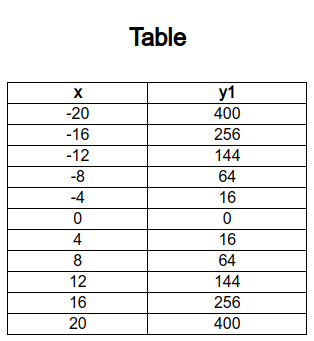

# Grapher

### Simple 2D Graph Plotting Website

---

A graph plotting software very simple not too much complex built using javascript. Functions like Polynomial, Logarithmic, Trignometric and Exponential Functions. Additionally, it can calculate the roots and intercepts of Functions by giving the guess.

We use [webpack](https://webpack.js.org/) for bundling the javascript files  & [expr-eval](https://npmjs.com/package/expr-eval) node library for evaluating the 
expression.

---

### File System

All the **backend files** are in the `/src` folder.

They all are bundled together using `webpack`  

```bash
src/
├── calculate.js
├── drawing.js
├── eventHandling.js
├── functionParsing.js
├── index.js
├── math.js
├── rendering.js
└── table.js
```

`calculate.js`:  Find the roots of the Graphs Using Newtons Methods , addes and event Listener to the calculate button in `index.html` and Render the Tabele using DOM.

`drawing.js`: Functions to drawing the on the canvas

`eventHandling.js`: Handles the DOM on `index.html` enables tab `functions, caluclate, table`, zoom in/out in cavans. 

`functionParing.js`: Evaluate the expression inspired by [expr-eval](https://github.com/silentmatt/expr-eval/tree/master)

`math.js`: Evaluate the set the precisions and roundoff the values.

`rendering.js`: Render the scale on the canvas graph and grid lines on the graph depending upon zoom in/out.

`table.js`: Render the table of x-coordinate of every mark, and y-coordinate based of function enterd.

## Example

The result of the equation entered by user is show here


| Equation        | Color  |
| --------------- | ------ |
| $20log10(x)$    | Blue   |
| $(1/2)x^2 - 15$ | Red    |
| $2^x$           | Orange |
| $cos(x)$        | Green  |

---
### Table

Render the Table of X-Coordinate and Y-Coordinate based of canvas and functions entered
eg for equation $y=x^2$



## Newton's method
Newton's method is an algorithm that estimates the root of a function *f(x)*. It is used in this graphing calculator. The algorithm takes in an inital guess *x<sub>0</sub>*, and applies this recursion finitely many times:

$$
x_{n+1} = x_{n} - f(x_{n})/f'(x_{n})
$$

Note: the function $f'$ is the derivative of $f$. The estimated root $x_{n}$ becomes more accurate as $n$ increases


## Special Thanks

I would like to thanks [AaronHe7](https://github.com/AaronHe7/) where i took some help and inspirations for this project.
